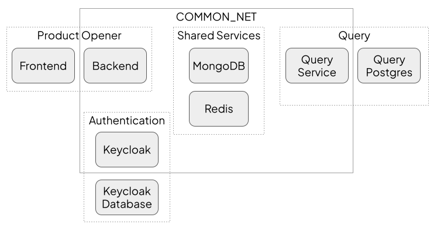

# Managing Service Dependencies

## Context and Problem Statement

As we split Open Food Facts up into smaller, more manageable, services, it becomes increasingly difficult for developers to know what additional services need to be deployed in order for the service they are working on to function correctly. This becomes increasingly difficult if the referenced service itself has other dependencies.

The following terminology is used for the different types of activity a local user might wish to perform:

* Development: This includes writing code and running automated tests
* Running: To see the service running and interacting with other services as close as possible to how it is deployed in production

For Development and testing purposes it is recommended that any non essential dependencies[^non_essential] are mocked or managed using tools like testcontainers, rather than relying on a separate service being up. This document concerns itself more with Running the project, i.e. creating a workable end-to-end deployment that can be used for ad-hoc, interactive testing and discovery.

[^non_essential]: It's up to project leaders to draw the line. A primary or secondary database is essential, while an OCR service might not be. 

This document is specifically concerned with "internal" dependencies where shared state is needed, e.g. each service can have its own independent database rather than relying on a shared database service, but the messaging system (Redis) needs to be shared in order for messages to pass between services. Dependencies on services outside the scope of Open Food Facts are referred to as "external" dependencies.

## Decision Drivers

* the definition of dependencies should be as close as possible to the particular service's source code
* existing tooling should be used wherever possible
* the mechanism to pull in any dependencies should be as simple and as fast as possible
* any mechanism needs to be compatible with all supported development environments, e.g. local code, dev containers, GitPod
* it should be relatively straightforward for a developer to switch from a simple "latest" deployment of a referenced service to a version that is also undergoing local development

## Considered Options

* Use the docker compose include command to reference dependencies in sibling folders
* Develop a custom tool that works from a list of dependencies defined in a file

## Decision Outcome

Custom tooling will be used so that we can cope with circular dependencies and to allow loading of dependencies to be performed using a single command.

### Consequences

Each project will have a makefile in its root folder with a target named "run". This target will fetch any missing dependencies from GitHub into a `DEPS_DIR` directory, change into each of the directories and execute `make run`. Note it is important to make each directory the working directory when running to ensure that local `.env` and `.envrc` files are imported.

It is suggested that the `DEPS_DIR` is defaulted to a `deps` subfolder under the project that initiated the run, but contributors to multiple projects may want to consider setting it to the parent of the current project so that all projects are cloned on a peer level.

The `make run` target must function when only the root folder of the project is cloned, e.g. when using `git clone --filter=blob:none --sparse ...` and should use the latest images from GitHub (i.e. not require a local build) by default. Note that the initiating project could override the image tag used from "latest" to "dev" to use a local container.

The `make run` target must not require any specific software to be installed on the host, other than docker, and any operating system commands can assume a bash shell (Windows users are recommended to use the Git Bash shell to run make commands).

If a project anticipates that it could be part of a circular reference then it should defend for this by setting a temporary environment variable, such as the `PROJECT1_RUNNING` variable in the example below.

```make
include .env
-include .envrc

export

# Set the DEPS_DIR if it hasn't been set already
ifeq (${DEPS_DIR},)
	export DEPS_DIR=${PWD}/deps
endif

# Space delimited list of dependant projects
DEPS=project2 project3

# Clone dependent projects
clone_deps:
	@mkdir -p ${DEPS_DIR}; \
	for dep in ${DEPS} ; do \
		echo $$dep; \
		if [ ! -d ${DEPS_DIR}/$$dep ]; then \
			git clone --filter=blob:none --sparse \
				https://github.com/openfoodfacts/$$dep.git ${DEPS_DIR}/$$dep; \
		else \
			cd ${DEPS_DIR}/$$dep && git pull; \
		fi; \
	done

# Run dependent projects
run_deps: clone_deps
	@for dep in ${DEPS} ; do \
		cd ${DEPS_DIR}/$$dep && make run; \
	done

# Called from other projects to start this project
run:
ifeq (${PROJECT1_RUNNING},)
	@export PROJECT1_RUNNING=true; \
	$(MAKE) run_deps; \
	docker compose up -d
endif
```

In this example the `clone_deps` and `run_deps` targets and the code that default the `DEPS_DIR` are reusable. The `run` target and `DEPS` list will be unique to each project.

Note that the make `ifndef` command and comments mustn't be indented.

It is important that `make -e` is not used as other projects may set the `COMPOSE_PROJECT_NAME` and `COMPOSE_FILE` environment variables which would override the local project's `.env` settings.

If a developer also wants to work on a referenced service they can easily convert the sparsely cloned repo into a full clone using `git sparse-checkout disable`. Note that the `blob:none` filter is still applied but this should not present too many complications.

#### Devcontainers

If a project supports devcontainers then dependencies should be resolved before running the devcontainer. This can be achieved by adding an `initializeCommand` to the `devcontainers.json` file, e.g.:

```
  "initializeCommand": "make run_deps",
```

As noted before, starting dependencies should only require docker, git and a bash shell, so running this command on the host should not undermine the benefit of using devcontainers.

#### Networks

Any services that need to be able to communicate with other services from other projects should be joined to a common, external docker network. The name of this network should be set using the `COMMON_NET_NAME` environment variable. For local development this is currently set to `po_off_default`, but this may soon be changed. The following diagram shows an example of services that use the common network:



[source of the diagram](https://docs.google.com/presentation/d/1N6pgEFQ7s9kAeN8Y53GHBBjADdxA1BqTghEAFgY6CsY/edit#slide=id.g211e97e0566_0_0)

#### Testing

In most cases tests should not rely on external dependencies and these should be mocked where appropriate. However, if an external dependency is essential for specific integration or end-to-end tests then the above described mechanism should _not_ be used and it is the originating project's responsibility to pull in the required dependencies and also take care of any further chained dependencies.

This could be achieved by adding a specific docker compose configuration invoked during tests to pull in additional dependencies, or by using a suitable [testcontainers](https://testcontainers.com/) implementation.

#### Deployment

Please ensure that project deployment actions do _not_ deploy dependencies.

### Confirmation

Compliance with this approach should become self-evident as project start to include dependencies from other projects.

If a dependency is found which requires more than just docker compose and a bash shell to run, then a bug should be logged in that repo.

Tools like GitPod [multi-repository working](https://www.gitpod.io/docs/configure/workspaces/multi-repo) support this approach.

## Pros and Cons of the Options

### Use docker compose include

This could use a docker compose syntax like this:

```
services:
  my-service:
    image: ghcr.io/openfoodfacts/service1:${SERVICE1_TAG}
    build:
      context: .
      dockerfile: Dockerfile

include:
  - ../service2/docker-compose.yml
```

* Good, because it uses a standard docker compose feature
* Good, because it also handles using .env files from the target project
* Neutral, because some kind of custom tooling or manual process is still needed to download the referenced repository
* Bad, because all dependencies get loaded into the same docker project
* Bad, because it can't handle circular dependencies

## Custom tooling

An agreed convention would be used for cloning dependencies and running a specific command on the clone to start the dependency and load any further chained dependencies.

* Good, because a single command can be run to bring up a service with all of its dependencies
* Good, because each repository can use its own docker project
* Neutral, because cloning referenced projects may take time.
* Neutral, environment variables need to be unique across projects to avoid conflicts (unless they refer to the same thing), e.g. database username and password variables would need to be prefixed with the owning service name, whereas the REDIS_URL could be shared
* Bad, because this will be something else that developers need to learn about when joining the team
