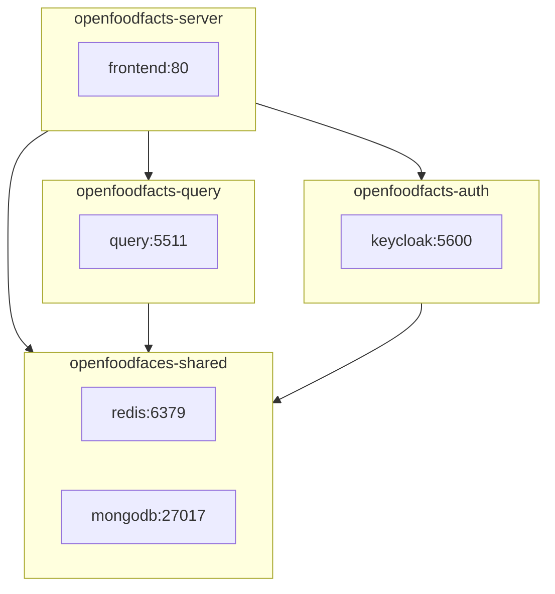

# Service Dependencies

This document uses [Mermaid](https://mermaid.js.org/) to visualize the dependencies between services.

In the future we may try to derive this from the `DEPS` declared in each repo. Only services that are exposed on the `COMMON_NET_NAME` network are show, with their respective port numbers.

